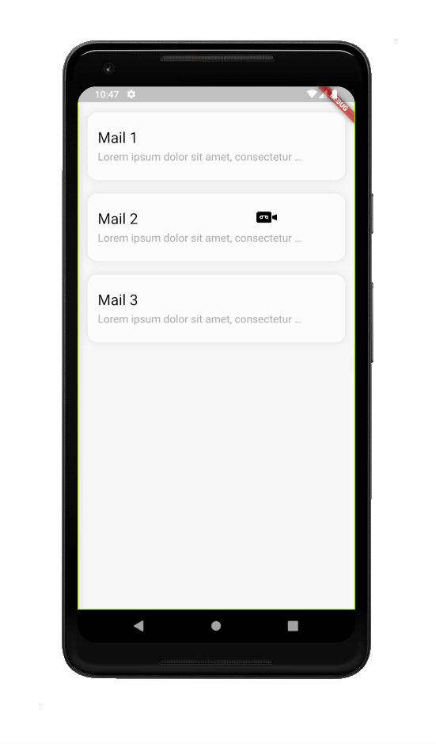

# Letter Refresh Indicator

Flutter Letter Refresh Indicator widget build on top of the [`custom_refresh_indicator`](https://github.com/gonuit/flutter-custom-refresh-indicator) package.

## Example

### GIF:




### Code

```dart
class MyList extends StatelessWidget {
  
  // ***

  @override
  Widget build(BuildContext context) {
    return LetterRefreshIndicator(
      onRefresh: _handleRefresh,
      child: ListView(
        children: <Widget>[],
      ),
    );
  }
}
```